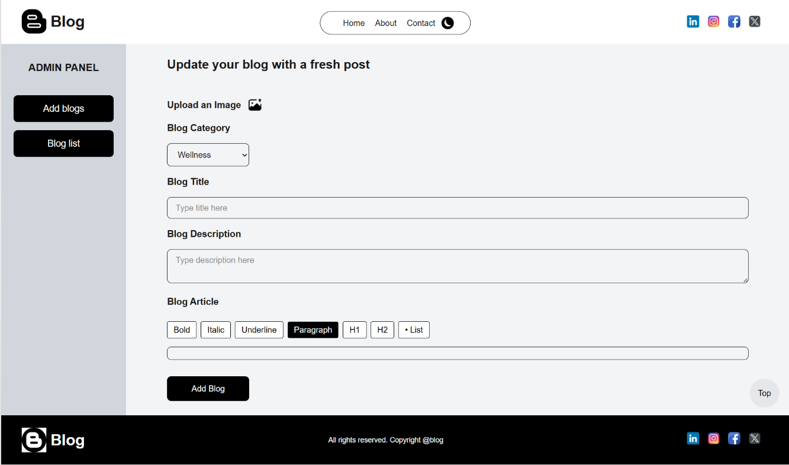

# Blog-Platform---Next.js-Tailwind-MongoDB

**Live Demo:** [Click Here](https://blog-platform-next-js-tailwind-mong.vercel.app/)

A simple blog platform built with Next.js and Tailwind CSS, connected to MongoDB for storing and retrieving blog posts.
Includes About and Contact pages.

# 🚀 Features
📝 Create, read, and display blog posts

📄 About page to describe the blog or author

📩 Contact page for user inquiries

🎨 Modern UI with Tailwind CSS

⚡ Fast rendering with Next.js

# 🛠 Tech Stack
Frontend: Next.js, Tailwind CSS

Backend: Next.js API Routes

Database: MongoDB with Mongoose

# Dashboard
Dashboard Design for Admin to upload Blog (used TipTap for Article Typing and includes blog list we can delete,edit)

